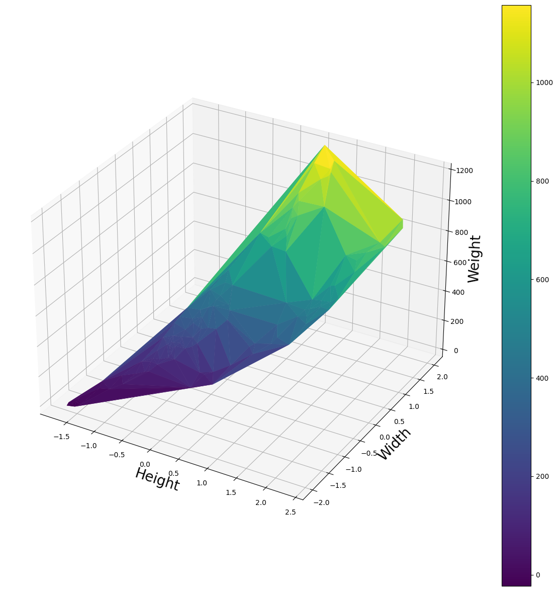

# Documentation

## Libraries Used

  1. **pandas**: Handles Table data (Loading, Saving, Modifying tables)
  2. **numpy**: Handles Matrix data (Define matrices and perform operations with them)
  3. **matplotlib.pyplot**: Plot Graph (Scatter, Surface, curve, etc.)

| ss | da | xczs | x | x |
|----|----|------|---|---|
|    |    |      | x |   |
|    |    | x    |   |   |
|    |    |      | x |   |

## Team Members

 1. Aryan Gupta - 2021A7PS0162H
 2. Subal Tankwal - 2021A7PS1407H